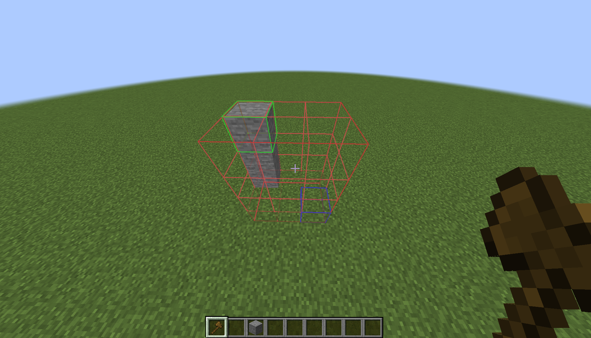

# 選取區用法與命令


本網頁的教學可能會包含更進階的 FastAsyncWorldEdit


## 選擇選區 

WorldEdit允許你以選擇長方體的兩個角上的點的方式來選擇長方體（想像一個3D的長方體）。\
下方的圖展示瞭如何用兩點形成一個長方體。你選擇的長方體是與 Minecraft 方塊對齊的。\

<figure><figcaption>
長方體選取區式意圖
</figcaption></figure>

有許多方法可以用來選擇這兩個點，你可以混合使用這些方法。
